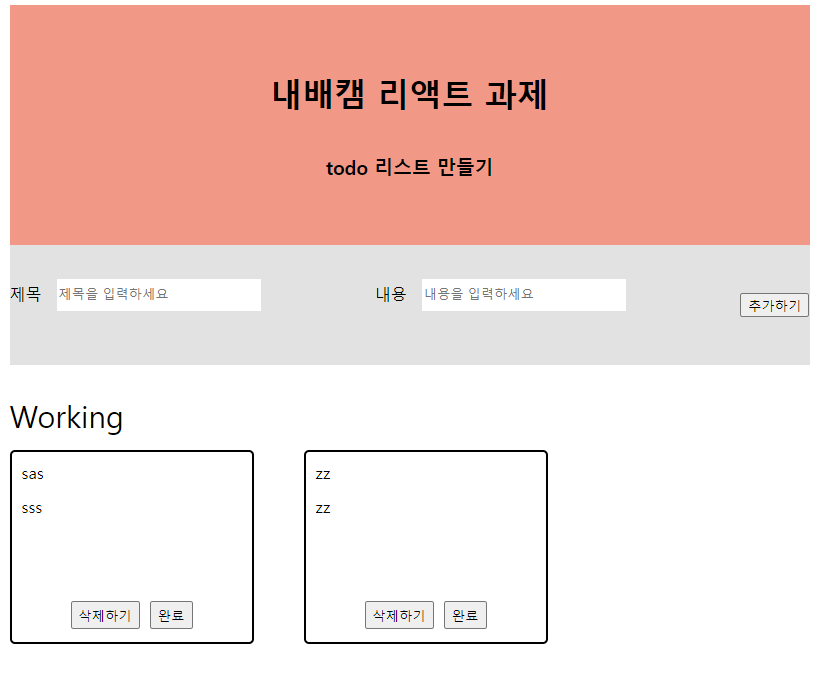
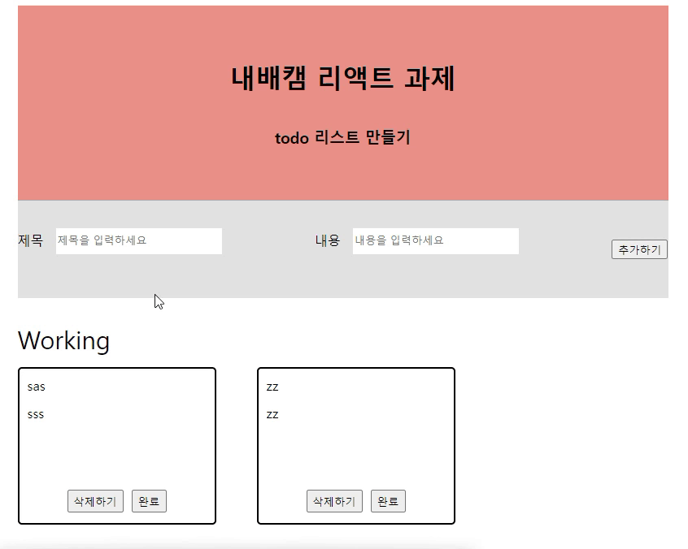
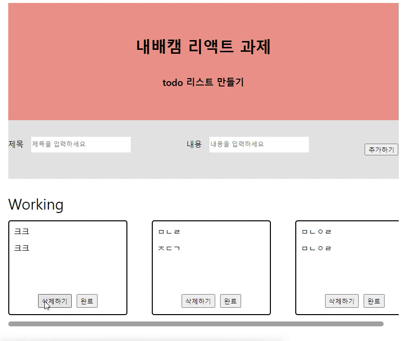
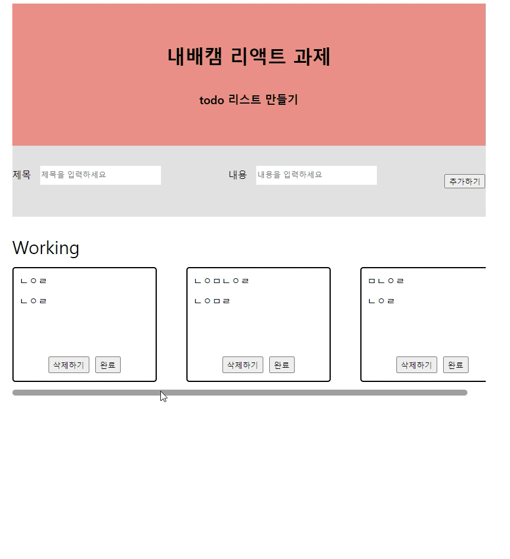
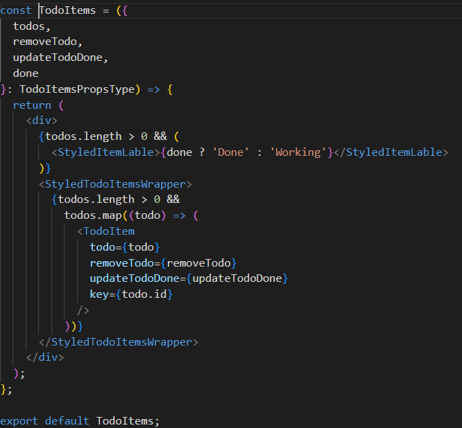

# 내배캠 리액트 첫번째 개인 프로젝트

## 🖥️ 프로젝트 소개

- 주제 : todolist
- 기간 : 24.01.17. ~ 24.01.19(3일)
- 주소 : https://picoloman6.github.io/nbc_react_1/
- 로컬 : firestorage key로 .env 생성 -> yarn dev

## ⚙️ 개발 환경

- FE : TypeScript, React, redux, styled-components, dotenv
- 배포 : vite, babel, Github Actions
- 서버 : firebase firestorage

## 🍿 프로젝트 화면 구성 및 기능

- 메인 화면
  

- todo 생성
  

- todo 삭제
  

- todo 상태 변경
  

## 📌 필수 구현 항목

- [x] todo 추가 및 input 상태 초기화
- [x] todo의 isDone이 true이면 취소 버튼, false이면 완료 버튼 생성
- [x] todo의 isDone이 false이면 화면의 위쪽, true의 아래쪽에 위치
- [x] Layout의 최대 넓이 1200px, 최소 넓이 800px로 제한하고 화면 가운데 정렬
- [x] 컴포넌트 구조 자유롭게 구현, 반복되는 컴포넌트 분리
      

## 📁 컴포넌트 파일 구성

- main.tsx : 최상단 컴포넌트
  - Header.tsx : 헤더 컴포넌트
  - TodoList.tsx : todo 컴포넌트
    - TodoInput.tsx : todo 입력창
    - TodoItems.tsx : todo 렌더링 화면,
      - TodoItems 컴포넌트: TodoList에서 todos props로 받아 레이블 표시하고, TodoItems에 개별 todo 전달
      - TodoItem 컴포넌트 : TodoItems에서 todo prop으로 받아 렌더링
